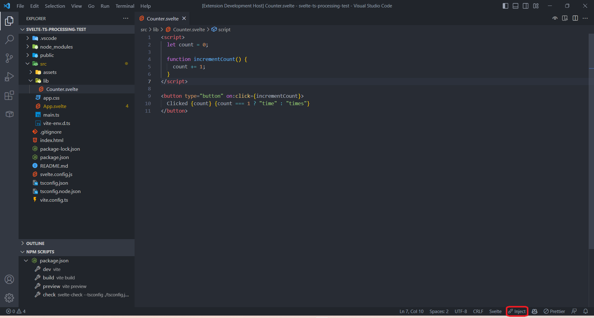
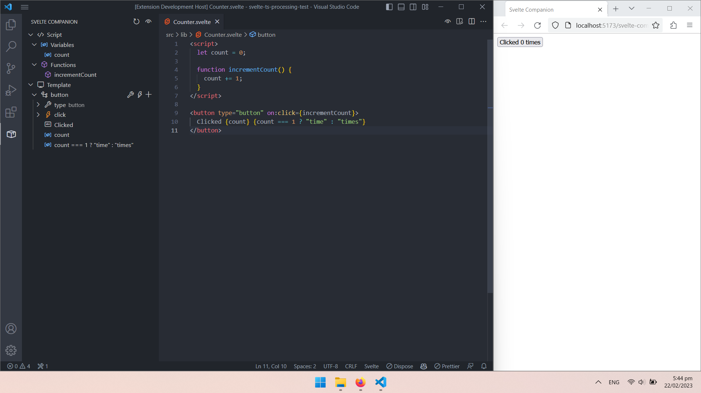

# Svelte companion

> Work in progress

The extension provides a tree view editor and a preview component for Svelte components. Allows editing Svelte components visually.

## Features

1. Run the development server
2. Inject the preview component with the "Inject" button on the status bar

> Remember to remove the preview component when building.

3. Open the tree view editor on the left activity bar

